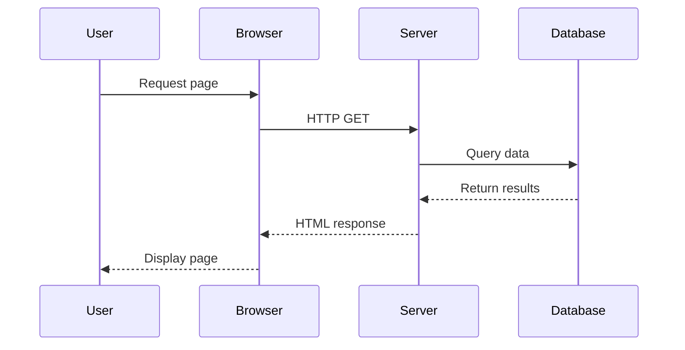
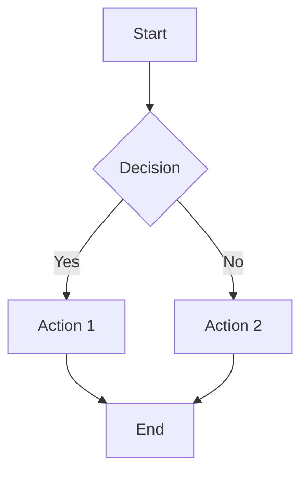

+++
title = "Example: All Shortcodes"
date = 2024-12-15
description = "Comprehensive example showing all available shortcodes"
math = true
tags = ["apacible","shortcodes", "documentation"]
categories = ["Examples"]
+++

This post demonstrates all available shortcodes in one place.

## Callouts

Callouts are useful for highlighting important information.


This is a note callout. Perfect for general information or reminders.



This is a tip callout. Great for sharing helpful hints or best practices.



This is an important callout. Use it to highlight critical information that readers must know.



This is a warning callout. Use it to alert users about potential issues or problems.



This is a caution callout. Use it to warn about dangerous or risky actions.


## Quotes

Beautifully styled quotes for highlighting important statements.


*Imagination is more important than knowledge. Knowledge is limited. Imagination encircles the world.*



*The best way to predict the future is to invent it.*


## Mermaid Charts

Mermaid diagrams are great for visualizing processes, workflows, and relationships.

### Sequence Diagram

### Flowchart

## Math (KaTeX)

Mathematical equations rendered beautifully with KaTeX.

### Inline Math

The quadratic formula is $x = \frac{-b \pm \sqrt{b^2-4ac}}{2a}$ when $a \ne 0$.

Einstein's famous equation: $E = mc^2$

### Block Math

The Fourier transform:

$$
F(\omega) = \int_{-\infty}^{\infty} f(t) e^{-i\omega t} dt
$$

The Cauchy-Schwarz Inequality:

$$\left( \sum_{k=1}^n a_k b_k \right)^2 \leq \left( \sum_{k=1}^n a_k^2 \right) \left( \sum_{k=1}^n b_k^2 \right)$$

## Outdated Alert

This post doesn't have the outdated alert enabled, but you can enable it by adding `outdate_alert = true` to the frontmatter. See the "Outdated Alert Example" post for a demonstration.

## Combining Shortcodes

You can combine shortcodes for rich content:


You can include math in callouts: $f(x) = x^2 + 2x + 1$



*Mathematics is the language with which God has written the universe.*


And you can use multiple callouts together:


Always test your shortcodes in different contexts.



Shortcodes make your content more engaging and easier to read.


