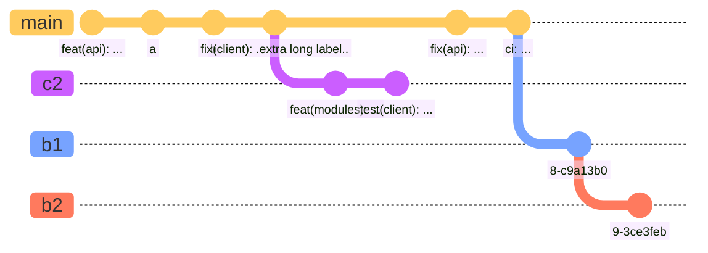

+++
title = "Apacible Theme: Complete Features Guide"
date = 2024-12-15
updated = 2024-12-15
description = "Comprehensive guide to all features and capabilities of the Apacible Hugo theme"
featured = true
toc = true
math = true
tags = ["apacible", "documentation", "features", "guide"]
categories = ["Apacible"]
+++

This comprehensive guide demonstrates all features and capabilities of the **Apacible** Hugo theme. From basic markdown to advanced shortcodes, image processing, and technical content—everything you need to know is here.

## Introduction

The Apacible theme is a minimalist Hugo theme prioritizing accessibility and smolweb principles, with unique dithered image support. This guide covers every feature with practical examples.

---

## Markdown Features

The theme supports all standard Markdown features with beautiful styling.

### Headings

Headings create clear hierarchy in your content:

## Heading Level 2

### Heading Level 3

#### Heading Level 4

### Emphasis

Normal text, **bold text**, *italic text*, ***bold and italic text***, and ~~strikethrough text~~.

### Lists

**Unordered lists:**
- First item
- Second item
- Third item

**Ordered lists:**
1. First item
   1. Indented item
   2. Indented item
2. Second item
3. Third item

### Links

There is a [link](https://example.com) and [another link to example.com](https://example.com).

### Tables

Basic table:

| Syntax      | Description | Test Text     |
| ---         |    ----     |           --- |
| Header      | Title       | Here's this   |
| Paragraph   | Text        | And more      |

With alignment:

| Syntax      | Description | Test Text     |
| :---        |    :----:   |          ---: |
| Left        | Center      | Right         |
| Paragraph   | Text        | And more      |

### Blockquotes

> Lorem ipsum dolor sit, amet consectetur adipisicing elit. Praesentium, nisi saepe dolor unde iusto dolore nam, vero optio consequuntur repudiandae et! Atque libero expedita laudantium cupiditate, sit explicabo sequi ipsa!

> Lorem ipsum dolor sit, amet consectetur adipisicing elit.
>> Nested blockquote: Praesentium, nisi saepe dolor unde iusto dolore nam, vero optio consequuntur repudiandae et! Atque libero expedita laudantium cupiditate, sit explicabo sequi ipsa!

### Footnotes

Lorem ipsum dolor sit, amet[^1] words consectetur[^2] adipisicing elit.

[^1]: First footnote.
[^2]: Here's the second footnote.

### Horizontal Rule

---

---

## Shortcodes

Shortcodes extend Markdown with powerful custom functionality.

### Callouts

Callouts are useful for highlighting important information.


This is a note callout. Perfect for general information or reminders.



This is a tip callout. Great for sharing helpful hints or best practices.



This is an important callout. Use it to highlight critical information that readers must know.



This is a warning callout. Use it to alert users about potential issues or problems.



This is a caution callout. Use it to warn about dangerous or risky actions.


### Quotes

Beautifully styled quotes for highlighting important statements.


*Imagination is more important than knowledge. Knowledge is limited. Imagination encircles the world.*



*The best way to predict the future is to invent it.*


### Detail/Expandable Content


Lorem ipsum dolor sit, amet consectetur adipisicing elit. Praesentium, nisi saepe dolor unde iusto dolore nam, vero optio consequuntur repudiandae et! Atque libero expedita laudantium cupiditate, sit explicabo sequi ipsa!

Lorem ipsum dolor sit, amet consectetur adipisicing elit. Praesentium, nisi saepe dolor unde iusto dolore nam, vero optio consequuntur repudiandae et! Atque libero expedita laudantium cupiditate, sit explicabo sequi ipsa!


### Combining Shortcodes

You can combine shortcodes for rich content:


You can include math in callouts: $f(x) = x^2 + 2x + 1$



*Mathematics is the language with which God has written the universe.*


---

## Dithered Images

The theme includes unique dithered image functionality. Images are shown in their dithered form by default, which reduces file size while maintaining a unique aesthetic. Click "**→ show original**" link below each image to toggle between dithered and original versions.

### Single Dithered Image



The dithering effect reduces the image to a limited color palette, creating a distinctive retro aesthetic while significantly reducing file size—perfect for the smolweb philosophy.

### Side-by-Side Comparison

For direct comparison, here's the same image shown in both forms:



### How It Works

**Processing**: Images are dithered using ImageMagick's ordered dithering algorithm:

```bash
magick input.jpg \
    -colorspace gray \
    -contrast-stretch 5%x5% \
    -normalize \
    -posterize 2 \
    -ordered-dither o4x4 \
    output_dithered.jpg
```

**Toggle Mechanism**: The shortcode generates HTML with both versions. JavaScript toggles visibility when the link is clicked:

```javascript
function toggleOriginal(element) {
  const container = element.closest('.image-container') || 
                    element.closest('figure').querySelector('.image-container');
  const dithered = container.querySelector('.dithered-img');
  const original = container.querySelector('.original-img');
  const showText = element.querySelector('.show-text');
  const hideText = element.querySelector('.hide-text');
  
  // Toggle visibility
  dithered.classList.toggle('active');
  original.style.display = dithered.classList.contains('active') ? 'none' : 'block';
  
  // Toggle link text
  showText.style.display = dithered.classList.contains('active') ? 'inline' : 'none';
  hideText.style.display = dithered.classList.contains('active') ? 'none' : 'inline';
}
```

**Benefits:**
- **Smaller Files**: Dithered images are typically 40-60% smaller
- **Faster Loading**: Reduced bandwidth usage
- **Progressive Enhancement**: Original available on demand
- **Unique Style**: Distinctive visual identity
- **Retro Appeal**: Nostalgic 8-bit aesthetic
- **High Contrast**: Often more readable
- **Smolweb Aligned**: Minimal data transfer
- **User Choice**: Original available when needed
- **Accessibility**: High contrast improves readability

**Usage:**
```markdown

```

**Note**: You must have both the original image and its dithered version (with `_dithered` suffix) in your assets folder. Use the `scripts/dither_images.sh` script to generate dithered versions automatically.

**Technical Details:**
- **Algorithm**: Ordered dithering (4x4 pattern) with high contrast and posterization
- **Color Space**: Grayscale conversion before dithering
- **Format**: Supports JPEG, PNG, WebP
- **Responsive**: Hugo's image processing creates optimized sizes
- **Fallback**: If dithered version missing, shows original only

---

## Code Blocks & Syntax Highlighting

The theme supports syntax highlighting for many programming languages.

### HTML

```html
<!DOCTYPE html>
<html lang="en">
<head>
    <meta charset="UTF-8">
    <meta name="viewport" content="width=device-width, initial-scale=1.0">
    <title>Document</title>
    <link rel="stylesheet" href="styles.css">
</head>
<body>
    <main>
        <h1>Hello World</h1>
        <p>Welcome to my site.</p>
    </main>
    <script src="script.js"></script>
</body>
</html>
```

### CSS

```css
:root {
    --primary-color: #3498db;
    --secondary-color: #2ecc71;
    --font-stack: -apple-system, BlinkMacSystemFont, 'Segoe UI', sans-serif;
}

.container {
    max-width: 1200px;
    margin: 0 auto;
    padding: 2rem;
}

@media (prefers-color-scheme: dark) {
    :root {
        --primary-color: #5dade2;
        --secondary-color: #58d68d;
    }
}
```

### Python

```python
from fastapi import FastAPI, HTTPException
from pydantic import BaseModel
from typing import List, Optional

app = FastAPI()

class Item(BaseModel):
    id: int
    name: str
    description: Optional[str] = None
    price: float

items_db = []

@app.get("/items", response_model=List[Item])
async def get_items():
    return items_db

@app.post("/items", response_model=Item)
async def create_item(item: Item):
    items_db.append(item)
    return item
```

### JavaScript

```javascript
function binarySearch(arr, target) {
  let left = 0;
  let right = arr.length - 1;
  
  while (left <= right) {
    const mid = Math.floor((left + right) / 2);
    
    if (arr[mid] === target) {
      return mid; // Found!
    } else if (arr[mid] < target) {
      left = mid + 1;
    } else {
      right = mid - 1;
    }
  }
  
  return -1; // Not found
}
```

### SQL

```sql
-- Create a users table
CREATE TABLE users (
    id SERIAL PRIMARY KEY,
    username VARCHAR(50) UNIQUE NOT NULL,
    email VARCHAR(100) UNIQUE NOT NULL,
    created_at TIMESTAMP DEFAULT CURRENT_TIMESTAMP
);

-- Query with joins
SELECT 
    u.username,
    u.email,
    COUNT(p.id) as post_count
FROM users u
LEFT JOIN posts p ON u.id = p.user_id
GROUP BY u.id, u.username, u.email
HAVING COUNT(p.id) > 5
ORDER BY post_count DESC;
```

### Bash

```bash
#!/bin/bash
set -e

# Colors for output
RED='\033[0;31m'
GREEN='\033[0;32m'
NC='\033[0m' # No Color

echo -e "${GREEN}Starting deployment...${NC}"

# Run tests
if npm test; then
    echo -e "${GREEN}Tests passed!${NC}"
else
    echo -e "${RED}Tests failed!${NC}"
    exit 1
fi
```

The theme supports many more languages including Go, Ruby, PHP, Java, C++, Rust, and more. All code is displayed with appropriate syntax highlighting based on the language identifier in the code fence.

---

## Mathematical Notation (KaTeX)

Mathematical equations rendered beautifully with KaTeX.

### Inline Math

The quadratic formula is $x = \frac{-b \pm \sqrt{b^2-4ac}}{2a}$ when $a \ne 0$.

Einstein's famous equation: $E = mc^2$

### Block Math

The Fourier transform:

$$
F(\omega) = \int_{-\infty}^{\infty} f(t) e^{-i\omega t} dt
$$

The Cauchy-Schwarz Inequality:

$$\left( \sum_{k=1}^n a_k b_k \right)^2 \leq \left( \sum_{k=1}^n a_k^2 \right) \left( \sum_{k=1}^n b_k^2 \right)$$

To enable math rendering, add `math = true` to your post frontmatter.

---

## Mermaid Diagrams

*Powered by [Mermaid](https://mermaid.js.org)*

Mermaid diagrams are great for visualizing processes, workflows, and relationships.

### Sequence Diagram


### Flowchart


### Git Graph



### Quadrant Chart


---

## Long-Form Content & Structure

Long-form content serves an important purpose in the digital age. While short, snappy content has its place, deeper exploration of topics requires space to breathe and develop ideas fully.

### Table of Contents

Enable automatic table of contents by adding `toc = true` to your frontmatter. This page has it enabled—check the sidebar!

### Structure and Organization

Effective long-form content requires careful structure:

**Clear Hierarchy**: Use headings and subheadings to create a clear outline. Readers should be able to scan the structure and understand the flow of ideas at a glance.

**Logical Progression**: Ideas should build on each other. Each section should connect naturally to the next, creating a cohesive narrative or argument.

**Visual Breaks**: Break up text with:
- Subheadings
- Pull quotes
- Lists
- Images
- Code blocks
- Whitespace

**Transitions**: Good transitions between sections help readers follow your train of thought. They provide context and maintain momentum.

### Writing Techniques

**Storytelling**: Even technical or educational content benefits from narrative elements. Stories make abstract concepts concrete and memorable.

**Varied Sentence Structure**: Mix short, punchy sentences with longer, more complex ones. This creates rhythm and keeps readers engaged.

Short sentences emphasize points. They create impact. Longer sentences, on the other hand, allow you to develop more nuanced ideas and explore the relationships between concepts, creating a more sophisticated and layered understanding of the topic at hand.

**Active Voice**: Active voice creates clearer, more direct writing. Instead of "mistakes were made," say "we made mistakes." It's more honest and easier to read.

**Concrete Examples**: Abstract concepts become clearer with specific examples. Don't just tell readers something—show them with real-world cases, data, or scenarios.

---

## Outdated Content Alert

The theme can automatically alert readers when content is outdated. Enable it by adding to your frontmatter:

```toml
outdate_alert = true
outdate_alert_days = 90
```

When a post is older than the specified number of days, an alert will be displayed at the top of the post. This helps maintain content quality and informs readers when information may be stale.

---

## Technical Examples

The theme excels at displaying technical content with proper formatting and syntax highlighting.

### Algorithm Examples

**Quick Sort** (Python):

```python
def quicksort(arr):
    """
    Quick sort algorithm implementation.
    Time complexity: O(n log n) average case
    Space complexity: O(log n)
    """
    if len(arr) <= 1:
        return arr
    
    pivot = arr[len(arr) // 2]
    left = [x for x in arr if x < pivot]
    middle = [x for x in arr if x == pivot]
    right = [x for x in arr if x > pivot]
    
    return quicksort(left) + middle + quicksort(right)

# Example usage
numbers = [3, 6, 8, 10, 1, 2, 1]
sorted_numbers = quicksort(numbers)
print(f"Sorted: {sorted_numbers}")
```

### Configuration Files

**TOML Configuration**:

```toml
base_url = "https://example.com"
title = "My Site"
description = "A demo site"

compile_sass = true
minify_html = false

[markdown]
highlight_code = true
highlight_theme = "base16-ocean-dark"
render_emoji = false
```

**JSON Configuration**:

```json
{
  "name": "my-project",
  "version": "1.0.0",
  "description": "A sample project",
  "main": "index.js",
  "scripts": {
    "start": "node index.js",
    "dev": "nodemon index.js",
    "test": "jest",
    "build": "webpack --mode production"
  },
  "dependencies": {
    "express": "^4.18.0",
    "dotenv": "^16.0.0"
  }
}
```

---

## Additional Features

### Dark Mode

The theme includes automatic dark mode with localStorage persistence. Users can toggle between light and dark themes, and their preference is saved.

### Responsive Design

All features are fully responsive and work beautifully on mobile, tablet, and desktop devices.

### Accessibility

The theme prioritizes accessibility with:
- WCAG compliant color contrasts
- Semantic HTML
- Keyboard navigation support
- Screen reader friendly markup

### Performance

- Optimized image processing
- Minimal JavaScript
- Fast page loads
- Smolweb philosophy

---

## Conclusion

The Apacible theme provides a comprehensive set of features for creating beautiful, accessible, and performant websites. From basic markdown to advanced technical content, everything is designed to work together seamlessly.

Whether you're writing blog posts, technical documentation, or long-form articles, the theme has the tools you need to create engaging, readable content.

For more information, see the [theme README](https://github.com/christiankopac/apacible) or explore the source code.

