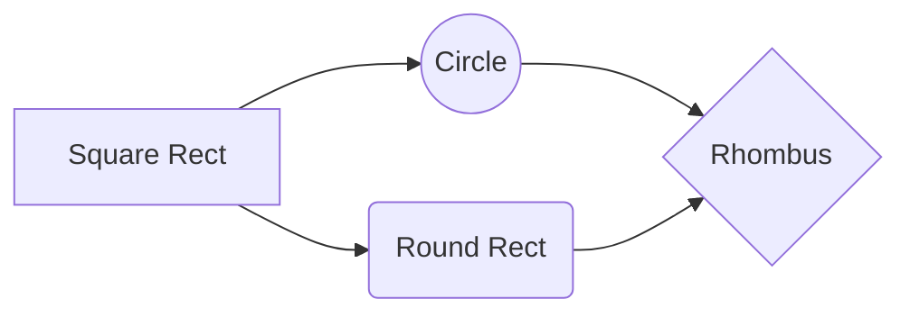
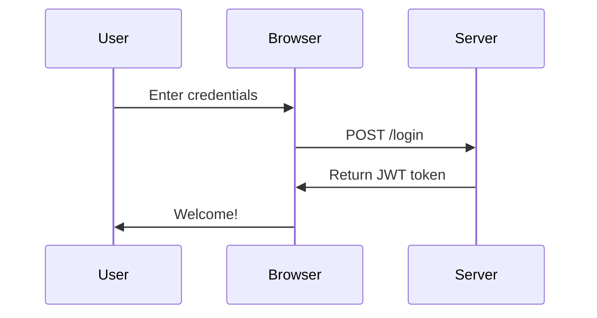

# Mermaid Diagrams - The Hugo Way ✅

## Implementation

Following [Hugo's official documentation](https://gohugo.io/content-management/diagrams/#mermaid-diagrams), we've implemented Mermaid diagrams using **code block render hooks** instead of shortcodes.

## How It Works

### 1. Code Block Render Hook
**File**: `themes/apacible/layouts/_markup/render-codeblock-mermaid.html`

```go-html-template
<pre class="mermaid">
  {{- .Inner | htmlEscape | safeHTML }}
</pre>
{{ .Page.Store.Set "hasMermaid" true }}
```

This automatically:
- Wraps mermaid code in `<pre class="mermaid">` tags
- Sets a page-level flag `hasMermaid` when mermaid code is detected
- No front matter configuration needed!

### 2. Script Loading (baseof.html)
**File**: `themes/apacible/layouts/_default/baseof.html`

```go-html-template
{{/* Mermaid for diagrams - auto-loaded when mermaid code blocks are present */}}
{{ if .Store.Get "hasMermaid" }}
  {{ partial "mermaid.html" . }}
{{ end }}
```

The script is **only loaded on pages that actually use mermaid**, keeping other pages lightweight.

### 3. Theme-Aware Configuration
**File**: `themes/apacible/layouts/partials/mermaid.html`

The partial includes:
- Dynamic theme detection (light/dark mode)
- Custom color palette matching site theme
- Automatic re-rendering on theme toggle
- ESM module from CDN (Mermaid 10+)

## Usage in Content

### ✅ Correct Usage (Markdown Code Blocks)

````markdown
## My Diagram


````

### ❌ Old Way (No Longer Needed)

```toml
+++
title = "My Post"
mermaid = true  # ❌ Not needed anymore!
+++

  # ❌ Shortcode not needed!
graph LR
    A --> B

```

## Benefits

| Feature | Old Way (Shortcode) | New Way (Render Hook) |
|---------|---------------------|----------------------|
| Front matter required | ✅ Yes `mermaid = true` | ❌ No |
| Syntax | Custom shortcode | ✅ Standard markdown |
| Auto-detection | ❌ Manual flag | ✅ Automatic |
| Hugo recommended | ❌ No | ✅ Yes |
| Code portability | ❌ Hugo-specific | ✅ Works everywhere |

## Supported Diagram Types

All Mermaid diagram types work:

- ✅ Flowcharts
- ✅ Sequence diagrams
- ✅ Class diagrams
- ✅ State diagrams
- ✅ Entity relationship diagrams
- ✅ User journey diagrams
- ✅ Gantt charts
- ✅ Pie charts
- ✅ Git graphs
- ✅ Quadrant charts
- ✅ And more...

## Theme Colors

### Light Mode
```javascript
{
  theme: 'base',
  themeVariables: {
    primaryColor: '#d98a7a',      // Soft terracotta
    primaryTextColor: '#1a1a1a',  // Dark text
    background: 'transparent',
    mainBkg: '#dfe5db',           // Sage green
    secondBkg: '#d2d9cd',         // Lighter sage
    // ... and more
  }
}
```

### Dark Mode
```javascript
{
  theme: 'dark',
  themeVariables: {
    primaryColor: '#e8a89a',      // Light coral
    primaryTextColor: '#f5f0e8',  // Light text
    background: 'transparent',
    mainBkg: '#1f1619',           // Deep burgundy
    secondBkg: '#2a1f23',         // Lighter burgundy
    // ... and more
  }
}
```

## Example

**Input** (in your markdown file):

````markdown
## Authentication Flow


````

**Output**: 
- Beautiful sequence diagram matching your site theme
- Automatically updates when user toggles dark/light mode
- No manual configuration needed

## Testing

### View Example Pages
1. http://localhost:1313/posts/mermaid-charts-example/
2. http://localhost:1313/posts/all-shortcodes-example/

### Verify Render Hook
```bash
# Check that render hook file exists
ls -l themes/apacible/layouts/_markup/render-codeblock-mermaid.html

# Check that mermaid script loads on pages with diagrams
grep "import mermaid" public/posts/mermaid-charts-example/index.html

# Count mermaid blocks in output
grep -c '<pre class="mermaid">' public/posts/mermaid-charts-example/index.html
```

## Migration Notes

### What Changed
1. ✅ Created `render-codeblock-mermaid.html` (render hook)
2. ✅ Updated `baseof.html` to check `.Store.Get "hasMermaid"` instead of `.Params.mermaid`
3. ✅ Converted all `` shortcodes to markdown code blocks
4. ✅ Removed `mermaid = true` from front matter (no longer needed)
5. ✅ Deleted `layouts/shortcodes/mermaid.html` (obsolete)

### Files Modified
- `themes/apacible/layouts/_markup/render-codeblock-mermaid.html` (new)
- `themes/apacible/layouts/_default/baseof.html` (updated)
- `content/posts/mermaid-charts-example.md` (converted)
- `content/posts/all-shortcodes-example.md` (converted)

## Reference

- [Hugo Official Documentation](https://gohugo.io/content-management/diagrams/#mermaid-diagrams)
- [Mermaid.js Documentation](https://mermaid.js.org)
- [Mermaid Live Editor](https://mermaid.live)

---

**Status**: Fully implemented using Hugo's recommended approach ✅  
**Compatibility**: Hugo 0.93+ with render hooks  
**CDN**: jsdelivr.net/npm/mermaid (ESM module)  
**Auto-detection**: No front matter required  
**Theme integration**: Automatic light/dark mode support

